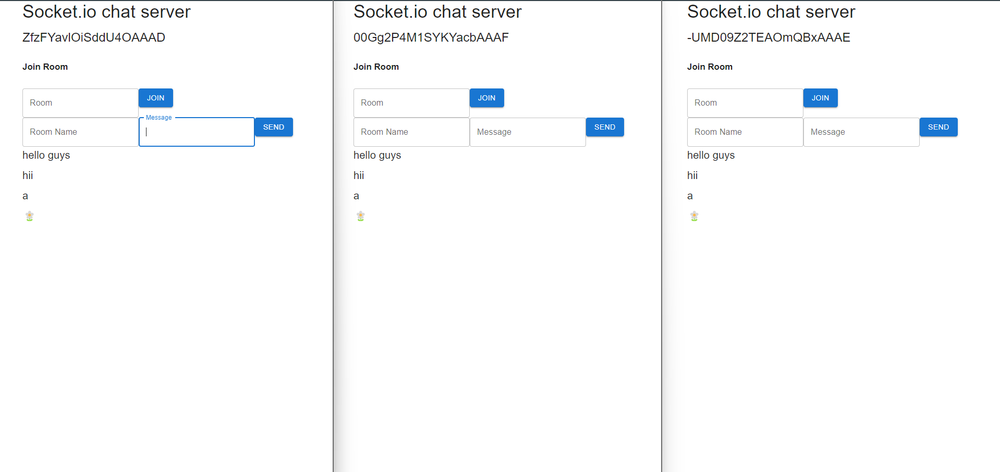

# Socket.io chat server

This project implements a real-time chat functionality using Socket.io, allowing users to communicate instantly with each other in a chat room environment.

## Table of Contents

1. [Installation](#installation)
2. [Usage](#usage)
3. [Configuration](#configuration)
3. [Screenshots](#screenshots)
3. [Troubleshooting](#troubleshooting)


## Installation

To get started with the project, follow these steps:

1. Clone the repository:
   ```bash
   git clone https://github.com/yourusername/your-project.git

## Usage

### Feature Overview

- Real-time chat functionality using Socket.io.
- Multiple chat rooms for users to join and communicate.
- User authentication and profile management.
- Private messaging between users.
- Emojis and rich text support in messages.

### Navigation Instructions

- Open the application in your web browser.
- Join a chat room or create your own.
- Start sending messages and interacting with other users.

### Command Line Interface (CLI)

If you're using the CLI interface, here are some available commands:

- `npm start`: Start the client application.
- `npm run dev`: Run the client in development mode.
- `npm test`: Run tests for the client code.
- `npm run build`: Build the client for production.

## Configuration
1. Navigate to the client directory:
   ``` bash
    cd your-project/client

2. Install client dependencies:
   ``` bash
    npm install

3. Run the client:
   ``` bash
    npm run dev

4. Navigate to the server directory:
   ``` bash
    cd your-project/server

5. Install server dependencies:
   ``` bash
    npm install

6. Run the server:
   ``` bash
    npm run dev

### Screenshots



#### ✨ After following these steps, you should have the client and server running, allowing you to start using the real-time chat functionality provided by Socket.io.


## Troubleshooting
If you encounter any issues with the application, refer to the troubleshooting section in the documentation or contact sakibdevlekar96@gmail.com for assistance.